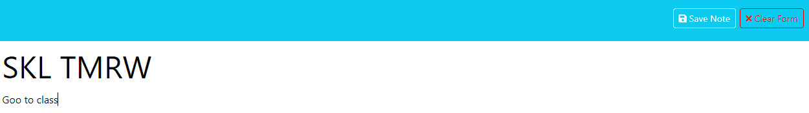

# Note Taker

## Description

This simple allows a user to write, save, store and delete notes with using Express.js for the backend.

- Coming soon! Delete function for once a note is complete.

## Installation

- There were 3 dependencies used inside:

1. express
2. fs
3. uuid

## Usage

- Install the above npm packages and then enter "node server.js" to have the server lisiten. Lastly, the complete application is deployed to Render.
- Link to website: https://note-taker-78zb.onrender.com

  1. 2.

## License

N/A

## Contributing

Thank you to my unrelenting ability to get the application to run after too long.

## Questions

If there are any questions please feel free to reach me via email or check out mmy Github profile: jjenkz.
